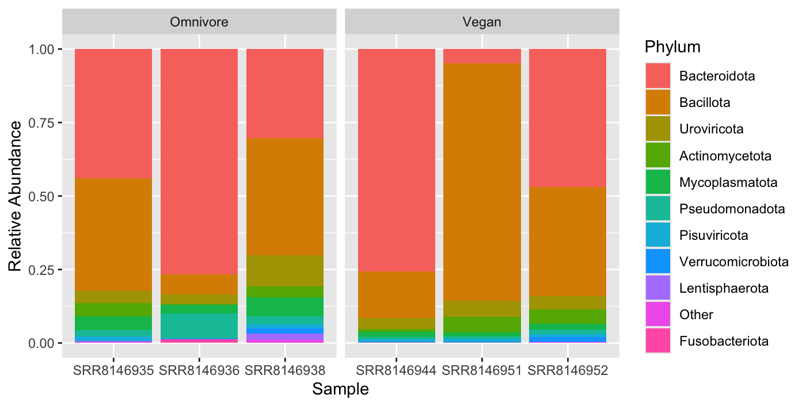
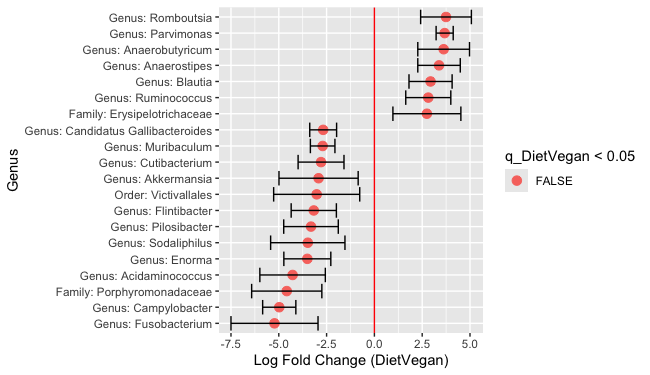
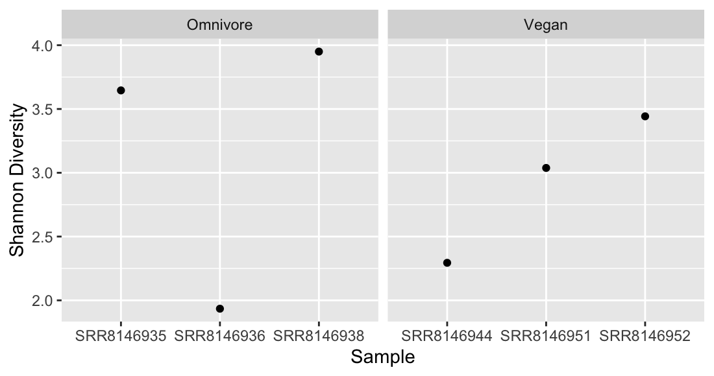
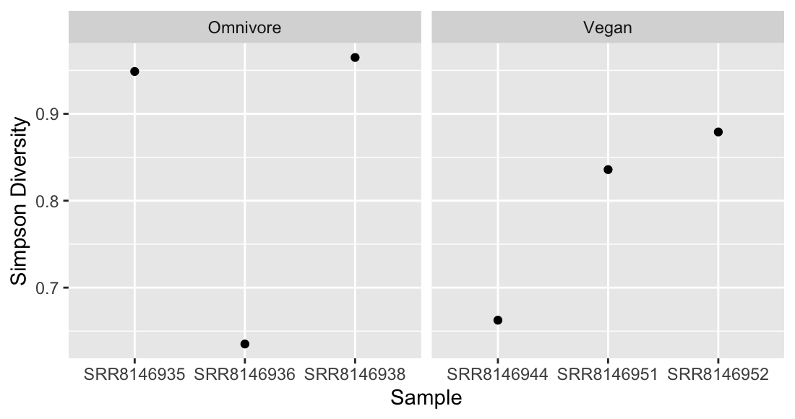
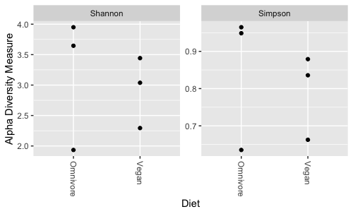
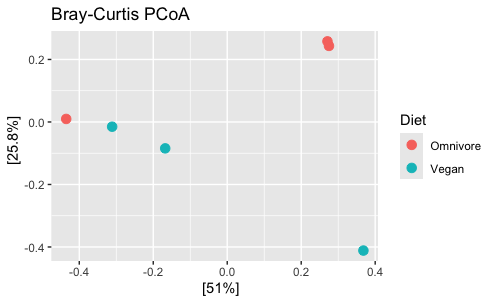

# human-gut-metagenomics
Taxonomic classification, community comparison and differential abundance analysis for human gut microbiomes with different diets

**Author:** Rebekah Hest  
**Course:** BINF6110 - Genomic Methods for Bioinformatics

## Assignment 3

This repository contains Assignment 3, a study to explore and compare taxonomic communities between microbial samples from shotgun metagenomics data of human gut microbiomes with different habitual diets including vegans and omnivores.

### Introduction

The human gut microbiome is a complex community that contributes to host metabolism and immune function by synthesizing vitamins and producing necessary metabolites that impact overall health (Toma et al., 2026). These diverse microbiota profiles consist primarily of bacteria but also include archaea, viruses, and other microorganisms where no single preferred composition has been determined because optimal functioning for disease prevention is specific to each individual (Rinninella et al., 2019). However, long- and short-term gut microbial ecology has been found to be largely modulated by diet and thus diet selection can be studied as prevention and treatment strategies for common diseases (Huang et al., 2024).
  
Plant-based diets tend to produce fiber-degrading microbes which provide anti-inflammatory effects and cardiovascular protection (Tomova et al., 2019). In contrast, a diet rich in animal foods can lead to protein fermentation which can be detrimental for the host’s health and contribute to can bowel diseases (Fackelmann et al., 2025). Characterization of microbial communities can be conducted via targeted 16S rRNA gene sequencing or shotgun metagenomics. Compared with 16S rRNA gene sequencing, shotgun metagenomics provides greater taxonomic resolution and microbial coverage and can reveal more biologically informative taxa (Durazzi et al., 2021). Furthermore, it enables direct characterization of the functional potential of the microbiome (Jovel et al., 2016). Therefore, the objective of this study is to compare gut microbial diversity and taxonomic composition between individuals consuming vegan and omnivorous diets using shotgun metagenomic sequencing data.
  
Taxonomic classification and species-level abundance estimation in metagenomic datasets can be performed using several computational approaches including alignment-based, marker gene-based, and k-mer based methods. Alignment-based approaches like BLAST offer high accuracy and specificity for detecting distant homologous relationships but require substantial computational resources for large reference databases (Altschul et al., 1990). Marker-based gene methods, such as metaPhlAn, instead classify reads using a curated set of clade-specific marker genes, reducing computational requirements but limiting detection to organisms represented by these markers (Blanco-Minguez et al., 2023). In contrast, k-mer based approaches assign reads based on exact matches of short sequence fragments, enabling rapid classification of large metagenomic datasets (Wood and Salzberg, 2014). Although k-mer–based classifiers such as Kraken2 may produce false positive assignments due to shared k-mers among related taxa, KrakenUniq attempts to mitigate this issue by tracking unique k-mers, but its substantially higher computational requirements often limit its practical use (Breitwieser et al., 2018). Kraken2 classifications can also be refined using Bracken to improve species-level abundance estimation through Bayesian re-estimation (Lu et al., 2017). Benchmarking studies have demonstrated that k-mer–based classifiers such as Kraken2 achieve high classification accuracy while maintaining substantially faster runtimes than other approaches (Ye et al., 2019).
  
To conduct Differential Abundance (DA) analysis for microbiome studies, several methods have been developed to address the challenge of handling the compositional nature of sequencing data. ANOVA-Like Differential Expression tool (ALDEx2) estimates relative abundance using a Bayesian estimation by Monte Carlo sampling (Fernandes et al., 2014). Analysis of composition of microbes (ANCOM-BC) applies bias correction to estimate log fold changes while accounting for unequal sampling fractions (Li and Peddada, 2024). ALDEx-2 has been shown to exceed the nominal level of False Detection Rate (FDR) (5%) and result in substantially smaller compared to other DA methods, whereas ANCOM-BC performs reasonably well for controlling FDR and maintains high recall power (Cappellato, Baruzzo, and Di Camillo, 2022; Li and Peddada, 2020).
  
This study will investigate and compare the human gut microbiome composition between individuals on a vegan and omnivore diet through taxonomic classification, diversity indices and a differential abundance analysis using shotgun metagenomic data from the research of De Filippis et al. (2019).

### Methods

#### Data Acquisition

Shotgun metagenomic data from the gut microbiome of healthy Italian individuals was downloaded from the Sequence Read Archive (NCBI-SRA: SRP126540). Six samples were selected based on diet (omnivore n = 3; vegan n = 3). Raw sequencing reads were downloaded using the SRA Toolkit (v3.2.1) with commands `prefetch` and `fasterq-dump` to retrieve and convert SRA files to FASTQ	 format. Taxonomic classification was performed using the Kraken2 Core_nt reference database (`k2_core_nt_20251015.tar.gz`), which includes a comprehensive collection of nucleotide sequences derived from GenBank, RefSeq, Third Party Annotation (TPA), and Protein Data Bank (PDB) entries.

#### Quality Control

Initial quality assessment of raw sequencing reads was performed using FastQC (v0.12.1) and summarized with MultiQC (v1.13) using the commands `fastqc` and `multiqc`. Quality metrics including per-base sequence quality, GC content, and sequence length distribution were evaluated. Multiple peaks were observed in the Per Sequence GC Content plots, suggesting the presence of adapter contamination or mixed sequence composition. Therefore, adapter trimming and quality filtering were performed using Trimmomatic (v0.39) in paired-end mode (`PE`). Nextera adapter sequences were removed using `ILLUMINACLIP:NexteraPE-PE.fa:2:40:15`, compatible with the Nextera DNA library preparation kit used for NextSeq 500 sequencing. Additional quality filtering was performed using default parameters`LEADING:3`, `TRAILING:3`, `MINLEN:36`, and `SLIDINGWINDOW:4:20` to remove low-quality bases and short reads (Bolger, Lohse, and Usadel, 2014). Post-trimming sequence quality was reassessed using `fastqc` and `multiqc` to confirm improvement in read quality metrics.

#### Taxonomic Classification

Quality-filtered paired-end reads (`*_paired.fastq`) were taxonomically classified using Kraken2 (v 2.1.6) with the `--paired` option against the Core_nt reference database (Wood, Lu, and Langmead, 2019). A confidence threshold of `--confidence 0.15` was applied to reduce false positive taxonomic assignments. The option `--use-names` was included to report taxonomic classifications using scientific names rather than taxonomic identifiers. Memory mapping (`--memory-mapping`) was not used because the database was loaded directly into memory on a high-memory compute node.

#### Abundance Estimation

Species-level abundance estimates were generated using Bracken (v3.0), which refines Kraken2 taxonomic assignments through Bayesian re-estimation (Lu et al., 2017). Kraken2 report files were used as input, and abundance estimates were calculated using a read length parameter of `-r 150` bp and taxonomic level `-l S` to produce species-level abundance profiles.

#### Data Pre-Processing

Bracken-adjusted taxonomic reports were converted into BIOM format using `kraken-biom`, which aggregates taxonomic abundance estimates across samples into a standardized BIOM table (Daboub, 2016). The BIOM file was imported into R (v.2026.01.1+403) using the `biomformat` package and integrated with sample metadata using the phyloseq package (v.1.52.0) to construct a phyloseq object containing taxonomic abundance data and associated sample metadata (McMurdie & Holmes, 2012). The metadata file (`metadata.tsv`) was adapted from the SRA metadata and included dietary classification (omnivore or vegan) and location (city) for each sample. This phyloseq object was used for downstream taxonomic composition summaries and diversity analyses. Rarefaction curves were generated to assess sampling effort. 

#### Relative Abundance Analysis

Relative taxonomic composition was evaluated at the phylum level by aggregating taxa using the `tax_glom` function in the phyloseq package (v.1.52.0). Relative abundances were visualized as stack bar plots per sample and grouped by dietary group to compare community composition. The top ten phylum by total abundance were retained and the remaining phylum were grouped into “Other” to improve interpretability. 

#### Alpha Diversity Analysis (Within-samples)

Alpha diversity was assessed using the Shannon and Simpson diversity indices, which capture both species richness and evenness within samples. Diversity metrics were calculated using the `estimate_richness` function in the phyloseq package (v.1.52.0). Diversity measures focused on rare taxa were excluded from this analysis since these estimates rely heavily on singletons but were absent following abundance re-estimation (Deng, Umbach, and Neufeld, 2024). Within-group differences were tested using a Wilcox rank-sum test for both Shannon and Simpson indices.

#### Beta Diversity Analysis (Between-samples)

Beta diversity was evaluated using Bray–Curtis dissimilarity, which incorporates differences in taxon abundances between samples. Ordination was performed using Principal Coordinates Analysis (PCoA) based on Bray–Curtis distances, implemented with the `ordinate` function in phyloseq. Differences in community composition between dietary groups were statistically assessed using permutational multivariate analysis of variance (PERMANOVA) with 999 permutations via the `adonis2` function in the vegan (2.7.3) package (Oksanen et al., 2026).

#### Differential Abundance Analysis 

To identify statistically significant differences in abundance of taxa between dietary groups, Analysis of Compositions of Microbes with Bias Correction (ANCOM-BC2) was conducted. This methodology accounts for sampling bias common in microbe studies while controlling the False Discovery Rate (FDR) (Lin & Peddada, 2020). The analysis was performed at the genus level (`tax_level = "Genus"`) using the `ancombc2` function from the ANCOMBC package (v.2.10.1), with died specified as the fixed effect (fix_formula = “Diet) and p-values were adjusted using the Holm Method (`p_adj_method = "holm"`). Taxa lacking genus-level classification were assigned to the lowest available taxonomic rank (e.g., family) to improve interpretability. Results were visualized for the top twenty taxa by absolute log-fold change. 

### Results

#### Taxonomic Composition

Across all samples, the gut microbiome was dominated by Bacteriodota and Bacillota, which account for the majority of relative abundance together in both dietary groups (Figure 1). Omnivore samples showed greater variability in phylum-level composition and a more balanced distribution of taxa, with one sample (SRR8146936) exhibiting a particularly high proportion of Bacillota. In contrast, vegan samples were more consistent in relative abundances among samples, except for one sample (SRR814951) that was strongly represented by Bactillota. Minor contributions from other phylum, including Uroviricota and Mycoplasmatota in lower relative abundance were observed across all samples.
  

 
**Figure 1. Stacked bar plots of relative abundance by phylum for six microbiome samples, grouped by diet (omnivore and vegan). Top 10 phyla by sum abundance are displayed and remaining 25 phylum are collapsed into one group labelled "Other".**

However, at the genus level, the differential abundance analysis using ANCOM-BC2 identified no taxa that were significantly different between dietary groups after multiple testing correction via the Holm-method (q > 0.05). Despite the lack of statistically significant results, several genera exhibited notable differences in log fold change between groups (Figure 2). Genera such as _Romboutsia_, _Parvimonas_, and _Anaerobutyricum_ showed higher relative abundance in vegan samples, whereas taxa including _Fusobacterium_ and _Campylobacter_ were more abundant in omnivore samples. The top twenty genera exhibiting the largest log-fold change primarily represented the phylum Bactillota followed by Bacteroida. 

 
**Figure 1. Log fold changes for the top 20 genera of 168 total genera comparing vegan and omnivore samples. Error bars represent uncertainty, and the red line indicates no difference. No genera were significantly different (q < 0.05).**

#### Microbial Community Structure
Alpha diversity was assessed using Shannon diversity in which there was no significant different between omnivore samples (mean ~ 3.18) and vegan samples (mean ~ 2.92) when evaluated using a Wilcox rank sum test (p = 0.7) (Figure 3). Similarly, Simpson diversity found no significant difference between dietary groups, omnivores (mean ~ 0.85) and vegans (mean ~ 0.79) using a Wilcox test (p = 0.7) (Figure 4). Both metrics displayed overlapping distributions, indicating comparable within-group diversity across diets (Figure 5). Between both diversity measures, the omnivore samples contained both high and low alpha diversity estimates, whereas the vegan samples were more consistent across samples.
  
 
**Figure 3. Shannon diversity indices for individual samples grouped by diet: omnivore (mean ~ 3.18), and vegan (mean ~ 2.92). No statistical difference was identified between the groups (p = 0.7).**
  
 
**Figure 4. Simspon diversity indices for individual samples grouped by diet: omnivore (mean ~ 0.85), and vegan (mean ~ 0.79). No statistical difference was identified between the groups (p = 0.7).**
  
 
**Figure 5. Comparison of alpha diversity metrics (Shannon and Simpson) between omnivore and vegan groups.**

The beta diversity measured using Bray-Curtis dissimilarity and PCoA revealed no distinct clustering of samples by group despite diet explaining 76.8% of the variation (PC1 = 51% and PC2 = 25.8%) (Figure 6). Along the first principal component, the samples were interspersed but the second principal component showed slight separation of the dietary groups. The PERMANOVA supported this showing that diet explained only 18.5% of the observed variation with no statistically significant difference between groups (R2 = 0.185, p = 0.5). Together, these results suggest substantial overlap in composition exists between the groups and that diet was not a strong determinant of microbial community structure.
  
 
**Figure 6. Principal coordinates analysis (PCoA) based on Bray–Curtis dissimilarity showing beta diversity between omnivore and vegan microbiome samples. Axes indicate the percentage of variance explained (PC1 = 51%, PC2 = 25.8%). Partial separation between groups is observed, though overlap indicates shared community structure.**

### Discussion

This study investigated the taxonomic compositional differences in human gut microbiome between individuals on an omnivore and vegan diet using shotgun metagenomic sequencing. The results indicate that diet was not a strong predictor of microbial variation in the dataset. The relative abundance profiles were similar across all samples, with both groups dominated by only a few phyla. In particular, Bactilla and Bacteriodota together comprised roughly 75% of the classified phyla for all samples, with varying ratios of the two taxa observed among the samples.
  
The alpha diversity analysis further supported this observation as neither Shannon nor Simpson indices showed no significant differences between dietary groups. This suggests that within-sample diversity and evenness were comparable between vegan and omnivore microbes. High alpha diversity has been observed to increase microbiome productivity and reduced disease risk (Bell et al., 2005). However, several diseases have been characterized by elevated diversity, indicating that alpha diversity alone is not a reliable indicator of host health (Williams et al., 2024). Therefore, the lack of significant differences in alpha diversity between dietary groups should be interpreted cautiously and does not necessarily reflect differences in health between diets.
  
Beta diversity metrics are often considered more sensitive than alpha diversity for detecting differences between microbial communities, particularly when using abundance-based measures such as Bray–Curtis dissimilarity (Kers and Saccenti, 2022). Despite this, no clear clustering of samples by dietary group was observed, suggesting that differences in community composition may have been subtle relative to within-group variability. However, beta diversity measures have been known to violate mathematical properties and can compromise downstream analyses including PCoA and PERMANOVA tests (Zhu et al., 2026). Coupled with the small sample size, these limitations may reduce the ability to accurately detect finer-scale differences in microbial community structure between dietary groups and may require a framework that further refines dissimilarity metrics.
  
Limitations in differential abundance detection may arise from the taxonomic classification using Kraken2 and abundance re-estimation with Bracken where ambiguous reads of higher taxonomic rank may be preferentially assigned to more common taxa. Consequently, rare taxa may be underrepresented in downstream analyses (Xu, Rajeev, and Salvador, 2023). ANCOM-BC2 may further reduce sensitivity to rare taxa, as it performs more reliably on common taxa and may have reduced power for low-abundance groups (Shi et al., 2024). Together, these factors bias the analysis toward dominant taxa and may not reliably capture the entire microbial community.
  
Although no taxa were significantly different between dietary groups, several genera exhibited notable differences in log fold change. For example, _Fusobacterium_ and _Campylobacter_ were more abundant in omnivore samples, while genera such as _Romboutsia_ and _Anaerobutyricum_ were relatively enriched in vegan samples. Previous studies have associated certain genera with dietary patterns, including increased abundance of short-chain fatty acid–producing taxa in plant-based diets (Egas-Montenegro et al., 2026; Soldan et al., 2024). While these observations are consistent with broader trends reported in the literature, they should be interpreted cautiously given the lack of statistical significance and limited sample size.
  
Overall, these results highlight the importance of sample size, tool selection and metric interpretation for microbiome studies. Additional research on microbiota composition and diversity is required to concretely determine the role and mechanisms by which diet influences host health.

## References
Altschul, S. F., Gish, W., Miller, W., Myers, E. W., & Lipman, D. J. (1990). Basic local alignment search tool. Journal of molecular biology, 215(3), 403–410. https://doi.org/10.1016/S0022-2836(05)80360-2 
Andrews, S. (2010). FastQC:  A Quality Control Tool for High Throughput Sequence Data [Online]. Available online at: http://www.bioinformatics.babraham.ac.uk/projects/fastqc/ 
Bell, T., Newman, J. A., Silverman, B. W., Turner, S. L., & Lilley, A. K. (2005). The contribution of species richness and composition to bacterial services. Nature, 436(7054), 1157–1160. https://doi.org/10.1038/nature03891 
Blanco-Míguez, A., Beghini, F., Cumbo, F., McIver, L. J., Thompson, K. N., Zolfo, M., Manghi, P., Dubois, L., Huang, K. D., Thomas, A. M., Nickols, W. A., Piccinno, G., Piperni, E., Punčochář, M., Valles-Colomer, M., Tett, A., Giordano, F., Davies, R., Wolf, J., Berry, S. E., Spector, T. D., Franzosa, E., Asnicar, F., Huttenhower, C., & Segata, N. (2023). Extending and improving metagenomic taxonomic profiling with uncharacterized species using MetaPhlAn 4. Nature biotechnology, 41(11), 1633–1644. https://doi.org/10.1038/s41587-023-01688-w 
Bolger, A. M., Lohse, M., & Usadel, B. (2014). Trimmomatic: a flexible trimmer for Illumina sequence data. Bioinformatics, 30(15), 2114–2120. https://doi.org/10.1093/bioinformatics/btu170 
Breitwieser, F.P., Baker, D.N. & Salzberg, S.L. (2018). KrakenUniq: confident and fast metagenomics classification using unique k-mer counts. Genome Biology, 19(198) https://doi.org/10.1186/s13059-018-1568-0 
Cappellato M., Baruzzo G., & Di Camillo B. (2022). Investigating differential abundance methods in microbiome data: A benchmark study. PLoS Computational Biology, 18(9), e1010467. https://doi.org/10.1371/journal.pcbi.1010467 
Dabdoub, S. M. (2016). kraken-biom: Enabling interoperative format conversion for Kraken results (Version 1.2) [Software]. Available at https://github.com/smdabdoub/kraken-biom 
De Filippis, F., Pasolli, E., Tett, A., Tarallo, S., Naccarati, A., De Angelis, M., Neviani, E., Cocolin, L., Gobbetti, M., Segata, N., & Ercolini, D. (2019). Distinct Genetic and Functional Traits of Human Intestinal Prevotella copri Strains Are Associated with Different Habitual Diets. Cell Host & Microbe, 25(3), 444–453.e3. https://doi.org/10.1016/j.chom.2019.01.004 
Deng, Y., Umbach, A. K., & Neufeld, J. D. (2024). Nonparametric richness estimators Chao1 and ACE must not be used with amplicon sequence variant data. The ISME journal, 18(1), wrae106. https://doi.org/10.1093/ismejo/wrae106 
Durazzi, F., Sala, C., Castellani, G., Manfreda, G., Remodini, D., & De Cesare, A. (2021). Comparison between 16S rRNA and shotgun sequencing data for the taxonomic characterization of the gut microbiota. Scientific Reports, 11, 3030. https://doi.org/10.1038/s41598-021-82726-y 
Egas-Montenegro E., Echeverria-Chilla J., García-Ulloa M., Aizaga-Benalcazar C., & Ordoñez-Araque R. (2026) The influence of a plant-based diet on the composition and functions of the human gut microbiota: a review. Frontiers in Nutrition, 13, 1774375. https://doi.org/10.3389/fnut.2026.1774375 
Ewels P., Magnusson M., Lundin S., & Käller M. (2016). MultiQC: summarize analysis results for multiple tools and samples in a single report. Bioinformatics, 32(19), 3047-8. https://doi.org/10.1093/bioinformatics/btw354 
Fackelmann, G., Manghi, P., Carlino, N., Heidrich, V., Piccinno, G., Ricci, L., Piperni, E., Arrè, A., Bakker, E., Creedon, A. C., Francis, L., Capdevila Pujol, J., Davies, R., Wolf, J., Bermingham, K. M., Berry, S. E., Spector, T. D., Asnicar, F., & Segata, N. (2025). Gut microbiome signatures of vegan, vegetarian and omnivore diets and associated health outcomes across 21,561 individuals. Nature microbiology, 10(1), 41–52. https://doi.org/10.1038/s41564-024-01870-z 
Fernandes A. D., Reid J. N., Macklaim J. M., McMurrough T. A., Edgell D. R., & Gloor G. B. (2014). Unifying the analysis of high-throughput sequencing datasets: characterizing RNA-seq, 16S rRNA gene sequencing and selective growth experiments by compositional data analysis. Microbiome, 2, 15. https://doi.org/10.1186/2049-2618-2-15 
Huang, K. D., Müller, M., Sivapornnukul, P., Bielecka, A. A., Amend, L., Tawk, C., Lesker, T. R., Hahn, A., & Strowig, T. (2024). Dietary selective effects manifest in the human gut microbiota from species composition to strain genetic makeup. Cell reports, 43(12), 115067. https://doi.org/10.1016/j.celrep.2024.115067 
Jovel J., Patterson J., Wang W/, Hotte N., O'Keefe S., Mitchel T., Perry T., Kao D., Mason A. L., Madsen K. L., & Wong G. K-S. (2016) Characterization of the Gut Microbiome Using 16S or Shotgun Metagenomics. Frontiers in Microbiology, 7, 459. https://doi.org/10.3389/fmicb.2016.00459 
Kers J. G., & Saccenti E. (2022). The Power of Microbiome Studies: Some Considerations on Which Alpha and Beta Metrics to Use and How to Report Results. Frontiers in Microbiology, 12, 796025. https://doi.org/10.3389/fmicb.2021.796025 
Lin H., & Peddada S. D. (2020). Analysis of microbial compositions: a review of normalization and differential abundance analysis. NPJ Biofilms Microbiomes, 6(1), 60. https://doi.org/10.1038/s41522-020-00160-w 
Lin, H., & Peddada, S. D. (2024). Multigroup analysis of compositions of microbiomes with covariate adjustments and repeated measures. Nature Methods, 21, 83–91. https://doi.org/10.1038/s41592-023-02092-7 
Lu J., Breitwieser F. P., Thielen P., & Salzberg S. L. (2017). Bracken: estimating species abundance in metagenomics data. Peer Journal of Computer Science, 3, e104. https://doi.org/10.7717/peerj-cs.104 
McMurdie P. J., & Holmes S. (2012). Phyloseq: a bioconductor package for handling and analysis of high-throughput phylogenetic sequence data. Pacific Symposium of Biocomputing, 235-46.  
Oksanen J., Simpson G., Blanchet F., Kindt R., Legendre P., Minchin P., O'Hara R., Solymos P., Stevens M., Szoecs E., Wagner H., Barbour M., Bedward M., Bolker B., Borcard D., Borman T., Carvalho G., Chirico M., De Caceres M., Durand S., Evangelista H., FitzJohn R., Friendly M., Furneaux B., Hannigan G., Hill M., Lahti L., Martino C., McGlinn D., Ouellette M., Ribeiro Cunha E., Smith T., Stier A., Ter Braak C., & Weedon J. (2026). vegan: Community Ecology Package. R package version 2.8-0, https://vegandevs.github.io/vegan/ 
Rinninella E., Raoul P., Cintoni M., Franceschi F., Miggiano G. A. D., Gasbarrini A., & Mele M. C. What is the Healthy Gut Microbiota Composition? A Changing Ecosystem across Age, Environment, Diet, and Diseases. Microorganisms. (2019) Microorganisms, 7(1), 14. https://doi.org/10.3390/microorganisms7010014 
Soldán, M., Argalášová, Ľ., Hadvinová, L., Galileo, B., & Babjaková, J. (2024). The Effect of Dietary Types on Gut Microbiota Composition and Development of Non-Communicable Diseases: A Narrative Review. Nutrients, 16(18), 3134. https://doi.org/10.3390/nu16183134 
Shi Y., Liu L., Chen J., Wylie K. M., Wylie T. N., Stout M. J., Wang C., Zhang H., Shih Y-C. T., Xu X., Zhang A., Park S. H., Jiang H., & Liu L. (2024). Simplified methods for variance estimation in microbiome abundance count data analysis. Frontiers in Genetics, 15, 1458851. https://doi.org/10.3389/fgene.2024.1458851 
Toma, R., Hu, L., Shen, N., Patridge, E., Wohlman, R., Banavar, G., & Vuyisich, M. The human gut microbiome activity is resilient and stable for up to six months: a large stool metatranscriptomic study. (2026). bioRxiv. https://doi.org/10.64898/2026.03.09.710644 
Tomova A., Bukovsky I., Rembert E., Yonas W., Alwarith J., Barnard N. D., & Kahleova H. The Effects of Vegetarian and Vegan Diets on Gut Microbiota. (2019). Frontiers in Nutrition, 6, 47. https://doi.org/10.3389/fnut.2019.00047 
Williams C. E., Hammer T. J., & Williams C. L. (2024). Diversity alone does not reliably indicate the healthiness of an animal microbiome. The ISME Journal, 18(1), wrae133. https://doi.org/10.1093/ismejo/wrae133 
Wood D. E., & Salzberg S. L. (2014). Kraken: ultrafast metagenomic sequence classification using exact alignments. Genome Biology, 15(3). https://doi.org/10.1186/gb-2014-15-3-r46 
Wood D. E., Lu J., & Langmead B. (2019). Improved metagenomic analysis with Kraken 2. Genome Biology, 20(1), 257. https://doi.org/10.1186/s13059-019-1891-0 
Xu, R., Rajeev, S., & Salvador, L. C. M. (2023). The selection of software and database for metagenomics sequence analysis impacts the outcome of microbial profiling and pathogen detection. PloS one, 18(4), e0284031. https://doi.org/10.1371/journal.pone.0284031 
Ye S. H., Siddle K. J., Park D. J., & Sabeti P. C. (2019). Benchmarking Metagenomics Tools for Taxonomic Classification. Cell, 178(4), 779-794. https://doi.org/10.1016/j.cell.2019.07.010 
Zhu, Z., Zhang, Y., Li, W. Greenacre, M., Saha, S., Shi, Y., & Zhang, L. (2026). Mathematical Foundations of Beta Diversity: Why Common Metrics Fail in Microbiome Analysis. Journal of Statistical Theory and Applications, 25(9). https://doi.org/10.1007/s44199-025-00154-7 

